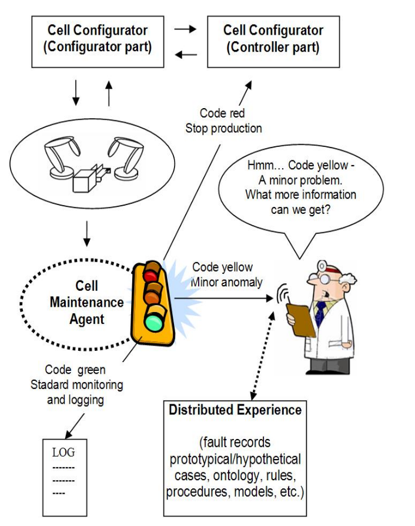

<!---->

# Factory in a Box Software Configuration &middot; [](https://travis-ci.org/npm/npm) [](https://www.npmjs.com/package/npm) [](http://makeapullrequest.com) [](https://github.com/your/your-project/blob/master/LICENSE)
> Additional information or tag line

A brief description of your project, what it is used for.

## Requirements

The application was tested with the following system

- node v12.9.0
- npm 6.14.12
- nvm 0.32.1

## Installing / Getting started

A quick introduction of the minimal setup you need to get a hello world up &
running.

```shell
npx truffle test
npx hardhat build
npx hardhat test
```

Here you should say what actually happens when you execute the code above.

## Developing

### Built With
List main libraries, frameworks used including versions (React, Angular etc...)

### Prerequisites
What is needed to set up the dev environment. For instance, global dependencies or any other tools. include download links.


### Setting up Dev

Here's a brief intro about what a developer must do in order to start developing
the project further:

```shell
git clone https://github.com/your/your-project.git
cd your-project/
packagemanager install
```

And state what happens step-by-step. If there is any virtual environment, local server or database feeder needed, explain here.

### Building

If your project needs some additional steps for the developer to build the
project after some code changes, state them here. for example:

```shell
./configure
make
make install
```

Here again you should state what actually happens when the code above gets
executed.

### Deploying / Publishing
give instructions on how to build and release a new version
In case there's some step you have to take that publishes this project to a
server, this is the right time to state it.

```shell
packagemanager deploy your-project -s server.com -u username -p password
```

And again you'd need to tell what the previous code actually does.

## Versioning

We can maybe use [SemVer](http://semver.org/) for versioning. For the versions available, see the [link to tags on this repository](/tags).


## Configuration

Here you should write what are all of the configurations a user can enter when using the project.

## Tests

Describe and show how to run the tests with code examples.
Explain what these tests test and why.

```shell
Give an example
```

## Style guide

Explain your code style and show how to check it.

## Api Reference

If the api is external, link to api documentation. If not describe your api including authentication methods as well as explaining all the endpoints with their required parameters.


## Database

Explaining what database (and version) has been used. Provide download links.
Documents your database design and schemas, relations etc... 

## Licensing

State what the license is and how to find the text version of the license.

## Sample Diagram for the Architecture

We need to comply with the following diagram: 



We need to define some test cases for stop production and keep going with minor software configuration issues.


## Sample Requiement Analysis

- Functional Requirements: 
    - Drilling: 
        - The system shall support drilling operations to create holes of specified diameters and depths.
        - It should be capable of handling various drill bit types and materials.
    - Slot Milling: 
        - The system shall enable slot milling for creating slots with defined widths and lengths
        - It should support different milling tools suitable for slot milling operations.
    - Slab Milling:
        - The system shall support slab milling for removing material from large flat surfaces.
        - It should allow the user to specify cutting parameters such as depth of cut and feed rate.
    - Step Milling: 
        - The system shall enable step milling for creating stepped surfaces.
        - It should provide options for defining step heights and widths.
    - Shaping:
        - The system shall support shaping operations to generate contoured surfaces.
        - It should allow users to define complex shapes and contours.
    - Reaming: 
        - The system shall support reaming operations for achieving high-precision hole dimensions.
        - It should accommodate different reaming tools and materials.

# Sample Requirement Analysis for Factory-in-a-Box members

FactoryBoxRoles:
Role Definition:

The system must allow the definition and configuration of various roles within a Factory Box.
Roles should include Maintenance Agent, Production Configurator, Production Controller, and Robot Arms.
Role Assignment:

Authorized users should be able to assign specific roles to individuals based on their responsibilities and qualifications.

MaintenanceAgent:
Maintenance Tasks:

Maintenance Agents should be able to log and manage maintenance tasks for machinery within the Factory Box.
Task Assignment:

The system should allow the assignment of maintenance tasks to specific Maintenance Agents based on their expertise.

ProductionConfigurator:
Production Configuration:

Production Configurators should have the ability to define and configure production processes within the Factory Box.
Resource Allocation:

Allocate resources efficiently for each production run based on predefined configurations.

ProductionController:

Production Monitoring:

Production Controllers should monitor and oversee ongoing production processes within the Factory Box.
Quality Control:

Implement quality control measures during production to ensure the output meets specified standards.
Non-Functional Requirements:
Real-time Data:

Provide real-time data and analytics for efficient decision-making during production.
Integration:

The system should integrate seamlessly with other Factory Box components.

RobotArms:
Functional Requirements:
Robotic Operations:

Robot Arms must perform specified operations as part of the production processes.
Precision:

Ensure precision and accuracy in executing tasks assigned during production.

RolesConstant:
Functional Requirements:
Constant Definitions:

RolesConstant must define constants for various roles within the Factory Box.
Consistency:

Ensure consistency in role names and definitions across the system.

MachineOperationConstant:

Operation Definitions:

MachineOperationConstant should define constants for various machine operations.
Clarity:

Ensure clear and concise definitions for each machine operation constant.

